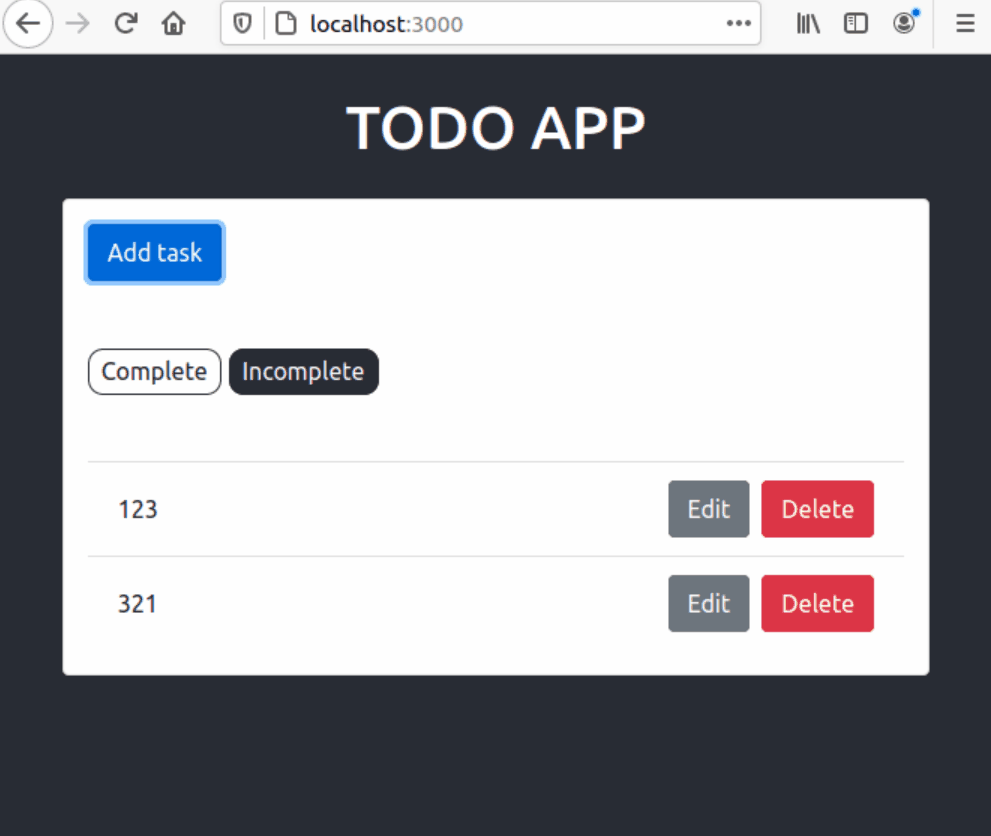

# Introduction

Follow [the tutorail](https://www.digitalocean.com/community/tutorials/build-a-to-do-application-using-django-and-react) to build a to-do application using Django and React. And rewrite components by using Hooks. Furthermore, docker-composify them by following [the tutorial](https://www.craigfranklin.dev/python/docker/javascript/2019/05/16/docker-compose-django-cra/) and do some tweaks.

<p align="center">
  
</p>

## Use

RUN

```shell
cd django-todo-react/
docker-compose up --build
```

STOP

```shell
cd django-todo-react/
docker-compose down
```

## My notes

- setting up the backend
  - create todo app and register to INSTALLED_APPS
  - defining the todo model and register it to adminsite
- setting up the APIs
  - install **djangorestframework** and **django-cors-headers**, then add them to INSTALLED_APPS and MIDDLEARE. Add lcoalhost to CORS_ORIGIN_WHITELIST.
  - creating **serializers** (rest framework) for the Todo model
  - creating the TodoView, and specify the URL path for the API
- setting up the frontend
  - install **bootstrap** and **reactstrap**, then import Bootstrap's stylesheet in src/index.js
  - install **axios** and add a proxy to frontend/package.json
